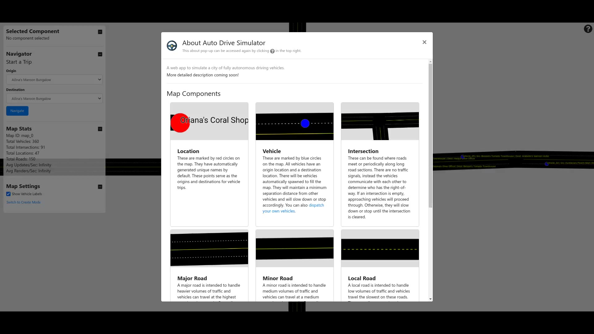
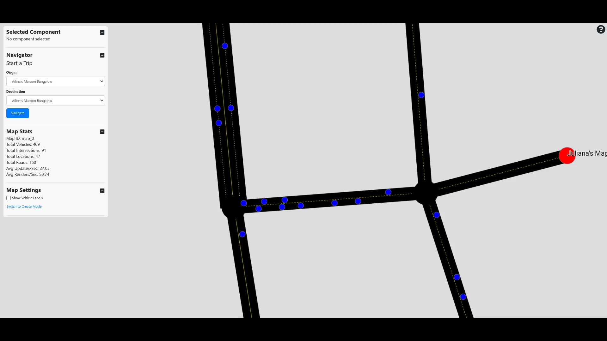
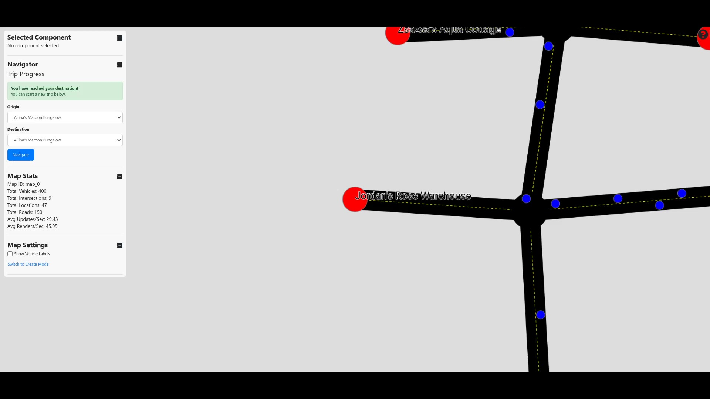

# Auto Drive Simulator - Frontend
*A web app to simulate a city of fully autonomous driving vehicles.*

[Try it out!](https://mchlp.github.io/auto-drive-simulator-app/)

**Overall Demo Video**

**Navigation Demo Video**

**Create Map Demo Video**

Built using Create React App.

[Link to Backend Repo](https://github.com/mchlp/auto-drive-simulator-api)
